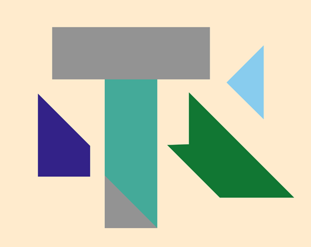

# T-Puzzle

**A tricky tiling puzzle made for Alex Bellos' guardian column.**

## About

This is my implementation of a classic puzzle written in javascript using p5.js. The backend was implemented using AWS Lambda. You can play it [here](https://technosquirrel.itch.io/t-puzzle). It was made for Alex Bellos' puzzle column for the guardian which can be found [here](https://www.theguardian.com/science/2025/sep/15/can-you-solve-it-the-simple-t-puzzle-that-fools-everyone-at-first).

## Author

Hello! I'm Phoebe Fletcher and I made this. You can find my other small game projects on [itch](https://technosquirrel.itch.io). I like open source software and creative coding. For business queries, you can contact me at technosquirrel.code@gmail.com.

## Acknowledgements

- Made with [p5.js](https://p5js.org/)
- I used the excellent [p5.collide2d](https://github.com/bmoren/p5.collide2D) library for collision detection

### License

